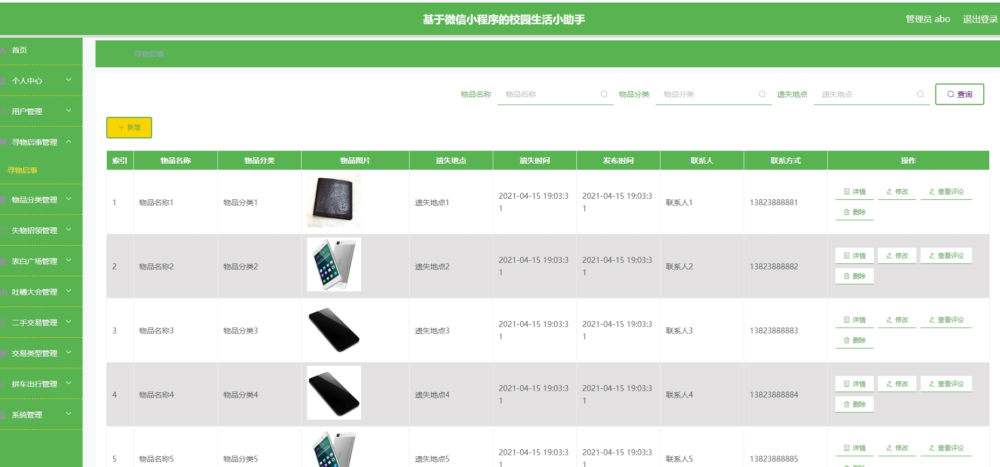

# 1.项目介绍
- 项目角色：管理员、普通用户
- 功能模块：管理员（用户管理、寻物启事管理、物品分类管理、表白广场、吐槽大会、二手交易、拼车出行等）、普通用户（登录注册、寻物启事、失物招领、表白广场、吐槽大会、拼车出行等）
- 技术选型:SSM、Vue、uniapp等
- 测试环境：idea2024，MySQL5.7，maven3，jdk1.8，HbuilderX，tomcat8等
# 2.项目部署
## 2.1 后端部署
- 通过navicat创建数据库，导入sql
- 通过idea打开项目，并根据本地数据库环境配置：3-5行
- 配置tomcat，路径配置为：/ssmbhhdb， 小程序请求url是该路径，你可以视情况自行修改
- 启动tomcat
- 后端管理web：http://localhost:8080/ssmbhhdb/admin/dist/index.html  管理员账号密码 ： abo/abo
## 2.2 小程序部署
- 说明：小程序采用的uni-app开发，项目目录是：src/main/webapp/front，你可以通过HbuilderX进行打开，然后根据需求进行修改。如果你不做修改，可以按照下面的步骤操作
- 通过微信开发工具打开项目mp-weixin
- 小程序appid选择测试号即可（自行申请，当然你也可以自己创建一个小程序，使用其appid）
- 打开即可。首次打开无法正常显示的，点击“编译”试一下
- 登录测试即可。账号密码详见yonghu表
# 3.项目部署截图

# 4.获取方式
[戳我查看](https://gitee.com/aven999/mall)